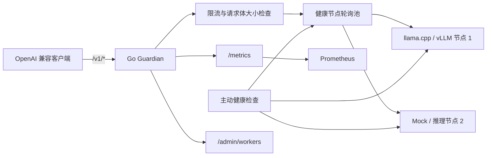

# LLM Serving Guardian

LLM Serving Guardian 是一个使用 Go 编写的、兼容 OpenAI API 的大模型推理高可用网关。它位于 Agent/AI 应用与 llama.cpp、vLLM 等推理实例之间，通过健康检查、熔断、故障节点摘除和响应提交前安全重试，降低单个 GPU 推理进程故障对客户端的影响，同时保留 SSE 流式输出并提供 Prometheus 可观测性。

项目定位是一个可在本地复现、具备生产系统关键语义的 AI Infra 实验项目，而不是 vLLM、llama.cpp 或 Kubernetes 的替代品。它重点验证一个容易被普通 HTTP 代理忽略的问题：**只有在响应尚未提交给客户端时才能安全重试；流式 Token 已经开始输出后，盲目切换节点会造成内容重复或响应损坏。**

## 项目价值

- 为 Agent、RAG 和聊天应用提供统一的 OpenAI 兼容推理入口。
- 在多个推理实例之间仅选择健康节点并进行轮询路由。
- 在连接失败或上游返回 5xx、且客户端尚未收到响应时自动重试。
- 流式响应开始后不进行破坏性重试，明确暴露中断而不是拼接两份输出。
- 通过主动探测与被动失败统计及时熔断故障节点，并在恢复后自动加入轮询。
- 提供结构化日志、关联请求 ID、Prometheus RED 指标和节点状态指标。
- 自带无模型 Mock 演示、真实模型启动脚本、压测客户端和故障注入实验流程。

## 架构



路由状态和熔断状态由同一个带互斥锁的节点池管理。一次失败只有在响应头和响应体都尚未发送给客户端时才允许重试，因此不会在 SSE 流中途重复生成内容。详细设计见[架构说明](docs/ARCHITECTURE.md)，接口行为见 [API 契约](docs/API.md)。

## 已验证能力

- 健康节点之间的轮询负载均衡。
- 主动 `/health` 探测与请求路径上的被动故障检测。
- 熔断、冷却和节点自动恢复。
- 响应提交前的连接错误与上游 5xx 安全重试。
- 兼容 llama.cpp/vLLM OpenAI 风格接口的 `/v1/*` 流式代理。
- 按客户端执行的令牌桶限流与请求体大小限制。
- 带关联 ID 的结构化 JSON 日志，默认不记录 Prompt 和请求体。
- Prometheus RED 指标、节点健康指标和基于故障现象的告警规则。
- 优雅退出、严格配置校验、单元测试、竞态检测和非 root 容器。

## 快速开始：无需模型的故障切换演示

环境要求：

- Go 1.26+
- PowerShell 7（Windows 演示脚本）

```powershell
git clone https://github.com/kungfudaibi/llm-serving-guardian.git
cd llm-serving-guardian

.\scripts\start-demo.ps1
.\scripts\demo-failure.ps1
.\scripts\stop-demo.ps1
```

启动脚本会运行两个轻量 Mock 节点（端口 `18081`、`18082`）和一个 Guardian 实例（端口 `8090`）。故障演示会让 `mock-one` 返回 503，展示请求如何切换到 `mock-two`，随后等待熔断恢复并输出节点状态。

也可以手动发送请求：

```powershell
$body = @{
  model = 'guardian-mock'
  messages = @(@{ role = 'user'; content = 'hello' })
  stream = $false
} | ConvertTo-Json -Depth 4

Invoke-WebRequest `
  -Method Post `
  -Uri 'http://127.0.0.1:8090/v1/chat/completions' `
  -ContentType 'application/json' `
  -Body $body
```

响应头中的 `X-Guardian-Worker`、`X-Guardian-Attempts` 和 `X-Request-Id` 分别表示最终服务节点、尝试次数和请求关联 ID。

## 使用本机 llama.cpp

仓库内的启动脚本默认适配以下本机目录：

```text
D:\Downloads\llama-b10343-bin-win-cuda-12.4-x64\llama-server.exe
F:\llm-serving-guardian\models\gemma-3-1b-it-Q4_K_M.gguf
```

启动真实 llama.cpp 节点：

```powershell
.\scripts\start-llama.ps1
```

如果模型文件不存在，脚本会将官方 806 MB GGUF 模型下载到 F 盘，校验文件长度与 SHA-256 后再启用。在另外两个终端中启动 Mock 备用节点和 Guardian：

```powershell
go run ./cmd/mock-worker -listen 127.0.0.1:8082 -name demo-worker
go run ./cmd/guardian -config ./configs/local.json
```

检查服务就绪状态、节点状态和监控指标：

```powershell
Invoke-RestMethod http://127.0.0.1:8090/readyz
Invoke-RestMethod http://127.0.0.1:8090/admin/workers
Invoke-WebRequest http://127.0.0.1:8090/metrics
```

如果 1B Q4 模型无法与其他 GPU 程序同时运行，可以关闭其他显存占用程序，或者降低 [`start-llama.ps1`](scripts/start-llama.ps1) 中的 `--n-gpu-layers`。

## Docker 与 Prometheus

Compose 环境不需要下载模型，默认使用两个 Mock 节点：

```powershell
docker compose up --build
```

| 服务 | 地址 |
|---|---|
| Guardian | http://127.0.0.1:8090 |
| Prometheus | http://127.0.0.1:9090 |

所有服务均配置为 `restart: "no"`，重新打开 Docker Desktop 不会自动启动该项目。停止并移除本项目容器：

```powershell
docker compose down
```

容器内进程使用非 root 用户运行。

## 配置

Guardian 通过 `-config` 接收一个严格校验的 JSON 配置文件。未知字段、不安全参数和未设置的环境变量引用都会导致启动失败；配置中的 `${ENVIRONMENT_VARIABLE}` 会在解析前展开。

```json
{
  "server": {
    "listen": "127.0.0.1:8090",
    "requestTimeout": "5m",
    "shutdownTimeout": "10s",
    "maxBodyBytes": 10485760,
    "rateLimitRPS": 10,
    "rateLimitBurst": 20
  },
  "health": {
    "interval": "5s",
    "timeout": "2s"
  },
  "circuit": {
    "failureThreshold": 3,
    "cooldown": "15s"
  },
  "proxy": {
    "maxAttempts": 2
  },
  "workers": [
    {
      "name": "local",
      "url": "http://127.0.0.1:8081",
      "apiKey": "${WORKER_API_KEY}"
    }
  ]
}
```

默认监听地址是本机回环地址，因为当前版本没有管理接口身份认证。**不要直接绑定公网地址**；如需远程访问，应在前方配置身份认证、TLS 和网络访问控制。

## 接口

| 接口 | 用途 |
|---|---|
| `GET /healthz` | Guardian 进程存活检查 |
| `GET /readyz` | 是否至少存在一个可用推理节点 |
| `GET /admin/workers` | 只读的节点健康与熔断状态快照 |
| `GET /metrics` | Prometheus 指标输出 |
| `/v1/*` | 受保护的 OpenAI 兼容推理代理 |

故障诊断和恢复步骤见[运维手册](docs/RUNBOOK.md)。

## 真实 GPU 实测

### 单 V100 性能基线

测试环境为 Tesla V100 PCIe 32 GB、Qwen2.5-1.5B-Instruct FP16、vLLM 0.6.6 和 XFormers。每个并发档位先预热 2 次，再采集 64 个请求；每个请求生成 64 个 Token。

| 并发数 | 请求吞吐（req/s） | 输出吞吐（tokens/s） | TTFT p50 / p95 / p99（ms） | E2E p50 / p95 / p99（ms） |
|---:|---:|---:|---:|---:|
| 1 | 1.99 | 127.65 | 33.25 / 33.88 / 34.52 | 501.36 / 502.00 / 502.24 |
| 8 | 13.83 | 885.34 | 37.23 / 64.28 / 64.37 | 568.57 / 595.49 / 595.59 |
| 16 | 25.29 | 1618.37 | 77.78 / 78.59 / 78.77 | 632.41 / 633.82 / 634.25 |
| 32 | 40.71 | 2605.75 | 116.02 / 117.23 / 117.62 | 785.32 / 788.44 / 788.78 |

并发 32 时，输出吞吐约为并发 1 的 20.4 倍，同时 TTFT p99 从 34.52 ms 上升至 117.62 ms。这些结果展示的是吞吐与延迟之间的权衡，不代表生产容量承诺。完整数据见[性能基线](benchmarks/README.md)和 [`benchmarks/results`](benchmarks/results)。

### 双 V100 真实故障切换

实验使用两张 Tesla V100 PCIe 32 GB，每张 GPU 运行一个 vLLM 0.6.6 实例；客户端保持 8 个并发 SSE 请求，并在运行过程中终止 GPU0 上的 vLLM 进程。

| 指标 | 实测结果 |
|---|---:|
| 完成请求数 | 988 |
| 成功请求数 | 984 |
| 请求成功率 | 99.595% |
| 响应提交前透明重试成功数 | 2 |
| 已开始输出后中断数 | 4 |
| 故障节点首次被摘除 | 0.802 秒 |
| 节点完成重启并重新加入 | 60.002 秒 |

故障影响了 6 条请求路径：其中 2 个请求尚未开始向客户端输出，因此被安全地切换到健康 GPU；另外 4 个请求已经从故障 GPU 开始流式输出，Guardian 没有进行可能造成重复内容的重试，而是明确报告中断。其余负载继续由 GPU1 提供服务。

60.002 秒恢复时间包含人为设置的重启等待、模型加载、CUDA Graph 捕获、vLLM 就绪和 Guardian 健康探测，并不是网关自身处理耗时。完整实验、限制说明和原始数据见[双 V100 故障实验](benchmarks/FAILOVER.md)。

## 开发与质量检查

```powershell
go test ./...
go vet ./...
go build ./...
```

Windows 上的 Go 竞态检测器需要 C 编译器，也可以通过容器执行：

```powershell
docker run --rm -v "${PWD}:/src" -w /src golang:1.26.5-alpine3.24 `
  sh -c "apk add --no-cache build-base && go test -race ./..."
```

测试仅使用回环地址上的 `httptest` 节点，不会下载模型。压测复现步骤见[基准测试说明](docs/BENCHMARKING.md)。报告性能结果时应同时记录硬件、模型、量化方式、上下文长度、并发数和 p50/p95/p99，避免只公布无法复现的吞吐数字。

## 当前边界

- 当前管理接口没有认证，默认只适合监听回环地址或受信任网络。
- 流式响应已经提交后无法无损迁移到其他推理实例。
- 双 V100 数据来自一次受控的进程终止实验，不覆盖网络分区、GPU 硬件故障和多节点同时故障。
- 当前路由不感知 Token 数、显存余量、KV Cache 压力或不同模型能力。
- 项目负责请求路径的可靠性，不负责模型调度、容器编排和 GPU 资源管理。

## 路线图

- 基于 Token 预算的准入控制和排队。
- Gateway 到推理节点的 OpenTelemetry 链路追踪。
- 带认证的独立管理接口。
- 按模型能力和请求语义路由。
- Kubernetes 服务发现、Pod Readiness 集成和过载保护策略。

## 参考资料

- [llama.cpp Server 文档](https://github.com/ggml-org/llama.cpp/blob/master/tools/server/README.md)
- [llama.cpp 缓存目录优先级（`LLAMA_CACHE`）](https://github.com/ggml-org/llama.cpp/blob/master/common/hf-cache.cpp)
- [Prometheus Go 应用接入指南](https://prometheus.io/docs/guides/go-application/)
- [Go `http.Server.Shutdown`](https://pkg.go.dev/net/http@go1.26.5#Server.Shutdown)
- [Go 官方容器镜像](https://hub.docker.com/_/golang)

## License

[MIT](LICENSE)
